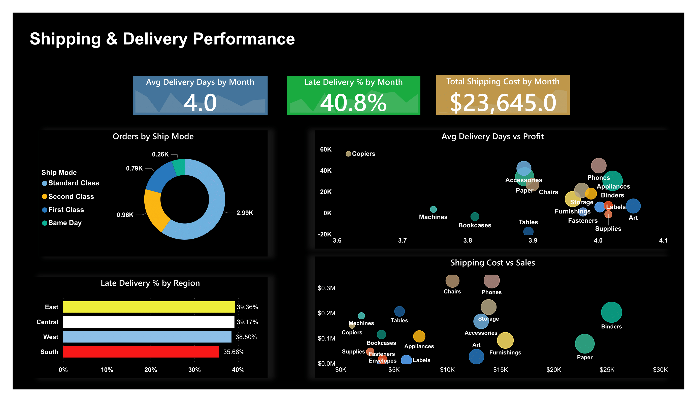

# Superstore Sales Performance Dashboard

## Project Overview

This project analyzes Superstore sales data using Microsoft Power BI to understand sales performance, profitability, customer segments, product categories, regional markets, discounts, sales opportunities, and shipping performance.

The dashboard transforms raw sales data into interactive business-focused visualizations and KPIs to support data-driven decision-making.

---

## Business Questions

The project focuses on answering the following questions:

- How are sales and profit changing over time?
- Which product categories contribute most to sales and profit?
- Which products perform well and which products underperform?
- Which customer segments generate the most business?
- How does performance vary across regions and markets?
- What is the relationship between discounts and profitability?
- Which sales opportunities require attention?
- How is shipping and delivery performance?
- Which areas of the business require further investigation?

---

## Key KPIs

The dashboard provides the following high-level metrics:

- *Total Sales:* $2.3M
- *Total Profit:* $286.4K
- *Orders:* 5,009
- *Customers:* 9,994

The dataset contains *9,994 rows and 26 columns*.

---

## Dashboard Analysis

### 1. Overview

Provides a high-level view of:

- Sales performance
- Profit performance
- Sales and profit trends
- Category-level performance
- Top and bottom performing products
- Overall business KPIs

### 2. Customer Segment Analysis

Analyzes business performance across different customer segments and helps identify differences in sales and profitability between segments.

### 3. Product Category Performance

Examines:

- Sales by product category
- Profit by product category
- Category contribution
- Product-level performance

### 4. Profit & Discount Analysis

Analyzes the relationship between:

- Discounts
- Sales
- Profit
- Profitability

This helps identify areas where discounting may require further investigation.

### 5. Regional Market Analysis

Analyzes sales and profitability across different geographic markets and regions to identify variations in business performance.

### 6. Sales Pipeline Opportunity Tracking

Provides a view of sales opportunities and helps identify areas that may require attention from a business perspective.

### 7. Shipping & Delivery Performance

Analyzes shipping-related performance and delivery metrics to understand operational patterns.

---

## Tools & Technologies

- *Power BI*
- *DAX*
- *CSV*
- *Data Visualization*
- *Business-oriented Analysis*
- *KPI Analysis*
- *Data Storytelling*

---

## Dataset

The project uses Superstore sales data containing:

- *9,994 rows*
- *26 columns*

The dataset includes information related to orders, customers, products, sales, profit, discounts, regions, and shipping.

---

## Project Structure

```text
superstore-sales-performance/
│
├── README.md
├── Superstore Sales Performance.csv
├── Superstore Sales Performance-Project.pbix
│
└── Screenshots/
    ├── Overview.png
    ├── Customer_Segment_Analysis.png
    ├── Product_Category_Performance.png
    ├── Profit_Discount_Analysis.png
    ├── Regional_Market_Analysis.png
    ├── Sales_Pipeline_Opportunity_Tracking.png
    └── Shipping_Delivery_Performance.png


## Dashboard Screenshots

### 1. Overview


### 2. Customer Segment Analysis


### 3. Product Category Performance


### 4. Profit & Discount Analysis


### 5. Regional Market Analysis


### 6. Sales Pipeline Opportunity Tracking


### 7. Shipping & Delivery Performance


